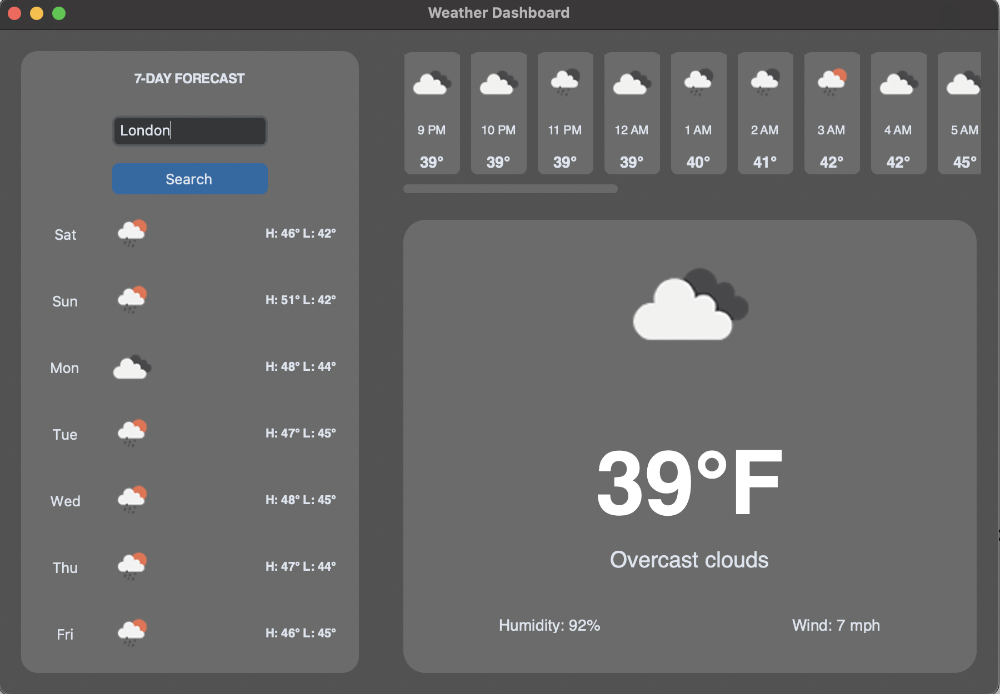

# WeatherFlow: Modern Weather Dashboard



WeatherFlow is a sleek and modern desktop weather dashboard built with Python and CustomTkinter. It provides real time current weather data, a detailed hourly forecast for the next 24 hours, and a 7-day daily forecast, all powered by the OpenWeather API.

## Features

* **Current Weather:** Instantly view temperature, description, humidity, and wind speed for any searched city.
* **Hourly Forecast:** Get a detailed look at the weather conditions for the next 24 hours.
* **7-Day Forecast:** Plan your week with a comprehensive overview of upcoming weather.
* **CustomTkinter UI:** Enjoy a modern, dark-themed user interface.

## Getting Started

Follow these instructions to set up and run WeatherFlow on your local machine.

### Prerequisites

* Python 3.x installed.
* An API key from [OpenWeather](https://openweathermap.org/).
    * **Important:** This project uses the **OpenWeather One Call API 3.0**. You will need to subscribe to the "One Call by Calls" plan in the OpenWeather Marketplace and provide payment details (even if you stay within the free tier limits). Standard free API keys for One Call 2.5 will **not** work.

### Installation

1.  **Clone the Repository:**
    ```bash
    git clone https://github.com/sashmeet96-ops/WeatherFlow.git
    cd WeatherFlow
    ```

2.  **Create a Virtual Environment (Recommended):**
    ```bash
    python3 -m venv venv
    source venv/bin/activate
    ```

3.  **Install Dependencies:**
    ```bash
    pip install -r requirements.txt
    ```

### Configuration

Before running the application, you must set your OpenWeather API key as an environment variable.

* **On macOS/Linux:**
    Open your terminal and add the following line to your shell profile file (e.g., `~/.bashrc`, `~/.zshrc`, or `~/.profile`). You can open it with `nano ~/.zshrc` (if using zsh):
    ```bash
    export OPENWEATHER_API_KEY="YOUR_OPENWEATHER_API_KEY"
    ```
    Replace `"YOUR_OPENWEATHER_API_KEY"` with your actual key. After saving, run `source ~/.zshrc` (or your respective file) to apply the changes.

* **On Windows (Command Prompt):**
    ```cmd
    setx OPENWEATHER_API_KEY "YOUR_OPENWEATHER_API_KEY"
    ```
    You may need to restart your command prompt for the changes to take effect.

* **On Windows (PowerShell):**
    ```powershell
    $env:OPENWEATHER_API_KEY="YOUR_OPENWEATHER_API_KEY"
    ```
    This sets the variable for the current session only. For permanent setting, you'd use System Environment Variables GUI.

### Running the Application

After configuring your API key, run the application from your terminal:

```bash
python3 main.py